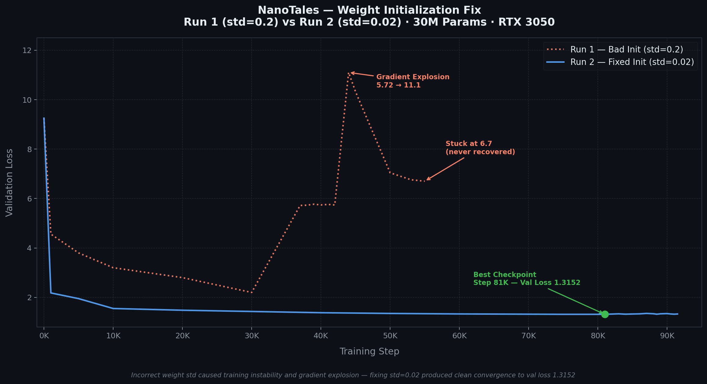

# NanoTales

NanoTales is a 30M parameter SLM trained to generate stories for children. It was trained on the TinyStories dataset for 23 hours across 2.65 billion tokens and is based on the GPT-2 architecture.

---

## 1. Model Architecture and Config

### Model Config

| Parameter | Value | Description |
|---|---|---|
| `vocab_size` | 10,000 | Number of unique tokens |
| `n_head` | 8 | Number of attention heads |
| `n_layer` | 8 | Number of transformer blocks |
| `d_model` | 512 | Embedding and hidden dimension |
| `block_size` | 256 | Maximum sequence length (context window) |
| `dropout` | 0.1 | Dropout probability |
| `bias` | True | Use bias in linear layers |

### Training Config

| Parameter | Value | Description |
|---|---|---|
| `batch_size` | 16 | Sequences per micro-batch |
| `gradient_accumulation_steps` | 8 | Effective batch = 16 × 8 = 128 sequences |
| `learning_rate` | 3e-4 | Peak learning rate |
| `min_lr` | 3e-5 | Minimum learning rate after cosine decay |
| `weight_decay` | 0.1 | AdamW weight decay |
| `beta1` | 0.9 | AdamW momentum coefficient |
| `beta2` | 0.95 | AdamW second moment coefficient |
| `grad_clip` | 1.0 | Gradient clipping threshold |
| `warmup_steps` | 200 | Linear LR warmup before cosine decay |
| `max_iters` | 100,000 | Total training steps |
| `eval_interval` | 500 | Compute validation loss every N steps |
| `eval_iters` | 100 | Number of batches used to estimate validation loss |
| `save_interval` | 1,000 | Save checkpoint every N steps |
| `block_size` | 256 | Sequence length used during training |
| `device` | cuda | Training device |
| `dtype` | bfloat16 | Mixed precision format |

---

## 2. Training Loss Curve



The first training run (red dotted) failed due to incorrect weight initialization. The second run (blue solid) converged cleanly to a validation loss of **1.3152** at step 81,000.

### Why Weight Initialization Matters

When activations (neuron outputs) are large, the model operates in a loss landscape where a tiny change in weights results in a huge change in loss. Since the gradient with respect to a weight is `∂L/∂W = ∂L/∂z · x`, if the input `x` from the previous layer is large, the gradient `∂L/∂W` is also large.

The neural network tries to generate distinguishable representations for different inputs. This ability gets completely destroyed when the variance of the neurons is high. For example, `[12, 8, 10]` and `[1.2, 0.8, 1.0]` produce the same softmax output `[0.98, 0.00, 0.02]`, so the model makes the same prediction regardless of the input.

The variance compounds multiplicatively across layers. By the time the signal reaches the output, it has been amplified to very large values. When these large logits go into softmax, the function assigns almost 100% probability to one single token. The network becomes very confident but is certainly wrong. In this situation the correct token probability `p_correct` is almost zero, so the cross-entropy loss `-log(p_correct)` approaches infinity.

Initializing weights with a small standard deviation (0.02) keeps activations stable across all layers and allows the model to learn with stable gradients.

---

## 3. Optimization Techniques

### Mixed Precision Training (bfloat16)

| Stage | Precision | Reason |
|---|---|---|
| Weights (master copy) | float32 | Full precision to preserve update accuracy |
| Forward pass | bfloat16 | Fast, uses half the memory |
| Backward pass | bfloat16 | Fast, uses half the memory |
| Optimizer update | float32 | Applied to float32 master weights |

bfloat16 is a 16-bit floating point format that keeps the same exponent range as float32 but reduces mantissa precision. It halves memory usage and nearly doubles training speed with no loss in training stability.

### Flash Attention

Standard attention computes the full `N × N` attention matrix between all tokens and stores it in GPU memory. For a sequence of 256 tokens this is 256 × 256 = 65,536 values — and GPU memory (HBM) is slow to read and write.

Flash Attention solves this by computing attention in small tiles directly in the GPU's fast on-chip cache (SRAM), never writing the full attention matrix to HBM. The result is mathematically identical but uses significantly less memory and runs faster. On an RTX 3050 with 6GB VRAM this was essential — without it the model would not fit in memory at the chosen batch size.

### Gradient Accumulation

With 6GB VRAM, a batch size of 128 sequences would exceed memory. Gradient accumulation simulates a large batch by running 8 smaller micro-batches of 16 sequences each, accumulating gradients across all 8 steps, and then applying a single optimizer update. The result is identical to training with a batch of 128 sequences while only ever holding 16 in memory at once.

---

## 4. How to Run

**Install dependencies:**
```bash
pip install torch tiktoken
```

**Clone the repository:**
```bash
git clone https://github.com/R-Sai-Chirag/NanoTales
cd NanoTales
```

**Generate stories:**
```bash
python generate.py
```

Edit the settings at the top of `generate.py` to change the prompt, temperature, or number of stories:

```python
PROMPT      = "Once upon a time"
TEMPERATURE = 0.8    # lower = safer, higher = more creative
TOP_K       = 40     # number of tokens to sample from
NUM_STORIES = 3
```

**Sample output** (prompt: *"A boy walked into a forest"*):

> A boy walked into a forest. He saw the man and he began to complain. He said he was lost and couldn't find his way home. The man saw the boy and asked him what was wrong. The boy told him about his situation. The man listened and said he would help the boy find his way home. They walked through the forest together and eventually found it. The boy was very happy and thanked the man for helping him. They both became good friends.